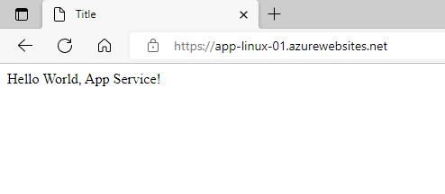

# How to Deploy a Hello World Linux Web App to Azure

Azure App Services allow you to host your web applications, APIs and backends in an environment that offers security, scaling, and load balancing without the need to host your own physical hardware, making them ideal for developers looking to hit the ground running.

In version 3.0 of the AzureRM Provider for Terraform, the azurerm_app_service resource was deprecated and will be completely removed in version 4.0. It has been replaced by 2 new resources. *azurerm_linux_web_app* and *azurerm_windows_web_app*. 

In this tutorial, you will learn how to deploy a Linux Web App running a  Hello World container.

# Prerequisites

In this hands-on tutorial, to follow along, you will need to have the following:

- An Azure Subscription - If you do not have an account with Microsoft Azure, you can sign up to [Try Azure for Free](https://azure.microsoft.com/en-us/free/).
- [Terraform CLI](https://www.terraform.io/)
- Azure CLI - [How to install the Azure CLI](https://docs.microsoft.com/en-us/cli/azure/install-azure-cli)

# Installing Prerequisites with Chocolatey

Prerequisites can be installed manually or by running the following commands with [Chocolatey](https://chocolatey.org/install)

```
choco install terraform
choco install azure-cli
```

# Setting up the Terraform Working Directory

First, Terraform will need a directory to run from that contains the configuration files. Choose a location where you would like to put this directory and create a folder called *Terraform_App_Service*.

```
mkdir ~/Terraform_App_Service
cd ~/Terraform_App_Service
```

In the *Terraform_App_Service* folder, create 2 files which will host the configuration:
- main.tf
- versions.tf

The *main.tf* file is going to be the "main" part of the configuration, containing the resources for the new Web App.

The *versions.tf* file is going to host the provider details for the AzureRM Terraform Provider. Check out the [AzureRM Terraform Provider Overview Page](https://registry.terraform.io/providers/hashicorp/azurerm/latest) to find the most recent version available.

Copy and paste the following code into the *versions.tf* file then save the changes.

```
terraform {
  required_providers {
    azurerm = {
      source = "hashicorp/azurerm"
      version = "3.11.0"
    }
  }
}

provider "azurerm" {
  features{}
}
```

Under *main.tf*, there are 3 resources that need to be created:

1. A *Linux Web App*
2. An *App Service Plan*
3. A *Resource Group* where the resources will be stored

The code below will deploy a Resource Group to the EastUS2 region in Azure, a Linux App Service Plan, and a Linux Web App running a [Python hello World container from Docker Hub](https://hub.docker.com/r/appsvcsample/python-helloworld).

Copy and paste the following code into the *main.tf* file then save the changes.

```
resource "azurerm_resource_group" "app-rg" {
  name     = "app-rg-01"
  location = "Eastus2"
}

resource "azurerm_service_plan" "asp_linux" {
  name                = "asp-linux"
  resource_group_name = azurerm_resource_group.app-rg.name
  location            = azurerm_resource_group.app-rg.location
  # reserved            = true
  os_type      = "Linux"
  sku_name     = "B1"
  worker_count = 1
}

resource "azurerm_linux_web_app" "as_linux" {
  name                = "app-linux-01"
  location            = azurerm_resource_group.app-rg.location
  resource_group_name = azurerm_resource_group.app-rg.name
  service_plan_id     = azurerm_service_plan.asp_linux.id

  site_config {
    always_on = true
    
    application_stack {
      docker_image     = "appsvcsample/python-helloworld"
      docker_image_tag = "latest"
      dotnet_version   = "6.0"
    }
  }
}
```
After both *main.tf* and *versions.tf* have both been saved, it's time to initialize the Terraform working directory and apply the configuration.

```
cd ~/Terraform_App_Service
terraform init
terraform plan
terraform apply
```

Once the apply is complete, browse to your web app by finding the URL on the App Service Overview Page. If everything deployed correctly, a page with the message "Hello World, App Service!" should appear in the browser.

